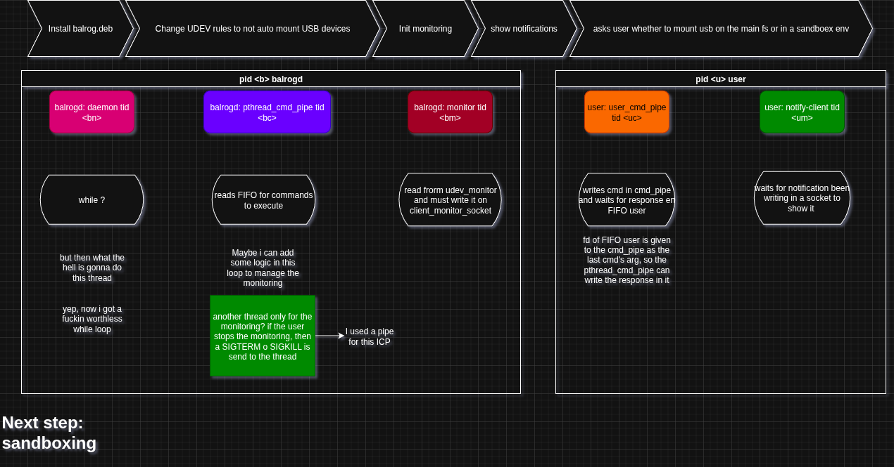

# Balrog

### First, this is an attempt to learn about Linux/OSS programming

### Then, Balrog is a Linux daemon that detects, monitors, and gives the option to use a sandbox enviromentm for suspicious USB devices, preventing malware spread via removable drives. Designed as a learning project, but aiming for practical use

[](LICENSE)


[](https://github.com/kevh-ppl/balrog/tree/dev)




## Debug

```bash
git clone https://github.com/kevh-ppl/balrog.git
cd balrog
make debug
```

## Installation

You may want to use the prebuilt DEB package:

[Download Balrog .deb](https://github.com/kevh-ppl/balrog/releases/download/dev-0.0.1/balrog_0.0-1_amd64.deb)

## Roadmap

- [x] Basic daemon
- [x] USB detection via udev
- [x] User notifications via libnotify
- [x] Udev rules to disable automount
- [ ] Sandboxing USB storage

Dios, ayúdame.
